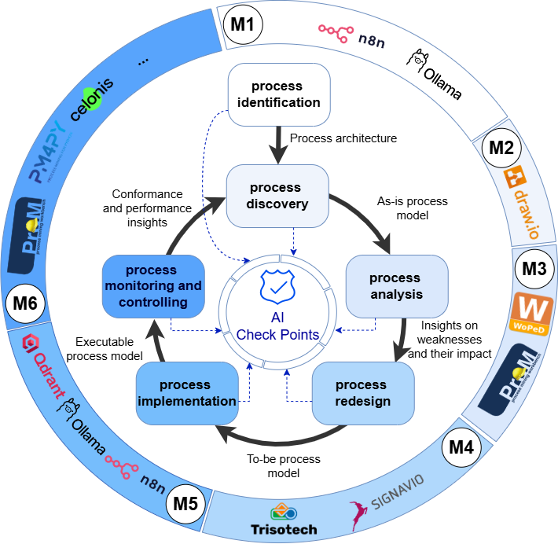

# Course Configuration Guide

This page explains how to instantiate the AI-decision checkpoint framework in a course. The six-module sequence below is the configuration used in the published study at Stockholm University. It is a starting point, not a prescription: instructors are expected to adapt it to their own context.

See [README.md](README.md) for a framework overview and [Module_Overview.md](Module_Overview.md) for detailed per-module content.

---

## The Six-Module Instantiation

| Module | Lifecycle phase | Checkpoint(s) | Tools used |
|---|---|---|---|
| M1 - Identification and AI Foundations | Process Identification | CP1 | n8n, Ollama |
| M2 - Normative As-Is Modeling | Process Discovery | CP2 | draw.io |
| M3 - Analysis and Initial Redesign | Process Analysis + Redesign (pass 1) | CP3, CP4 (pass 1) | WoPeD, ProM |
| M4 - BPMN Redesign | Process Redesign (pass 2) | CP4 (pass 2) | Signavio / Trisotech |
| M5 - Workflow Implementation | Process Implementation | CP5 | n8n, Ollama, Qdrant |
| M6 - Process Mining | Process Monitoring | CP6 | ProM, PM4Py, Celonis |

**Why CP4 spans two modules:** Students benefit from a simulation-informed workflow-net redesign in M3 before committing to a fully specified BPMN model in M4. This staged approach prevents over-investment in notation before the preferred design direction is analytically supported. Please note that this is how we instantiated the framework, and different instructors can configure it based on their needs and preferences.

---

## Adapting the Configuration

The checkpoints are independent enough to be selectively adopted. The right configuration depends on four factors.

**Course objectives.** A course focused on AI governance may foreground CP5 and CP6. A process design course may emphasise CP1-CP4. Checkpoints can be weighted or assessed independently without breaking the logic.

**Available tools.** All tools in this repository are replaceable. The checkpoint questions and artifact types stay the same regardless of the platform. 

**Student background.** Students with prior BPM experience can skip the M1 foundations content and enter at CP1 directly. Students without a modelling background may need extra scaffolding before M2 and M3.

**Course length.** A short workshop can cover CP1-CP2 using the Banking case as a discussion vehicle. A single-semester course can run the full M1-M6 sequence. An elective can enter at any phase using the corresponding case materials.

---

*Back to [README.md](README.md)*
