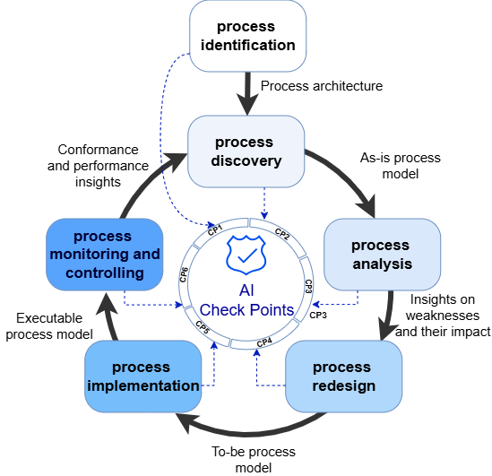

# AI-Decision Checkpoints for AI-Augmented BPM

> Jalali, A. (2026). *AI-Decision Checkpoints for AI-Augmented Business Process Management: Framework and Educational Instantiation*. BPM 2026 Educators Forum, Lecture Notes in Business Information Processing, Springer.

**Living repository.** This repository is updated regularly based on student feedback and instructor observations from each course offering. Previous versions of all materials remain accessible through the commit history.


## What is this?

Large Language Models, RAG, and AI agents are increasingly embedded in operational business processes, yet BPM curricula still largely treat AI as an add-on topic rather than a first-class design concern. **AI-decision checkpoints** address that gap.

A checkpoint is an explicit moment in a process development project at which students (act as process developer) must:

1. identify AI-candidate sub-processes within the current scope
2. assess expected effects on time, cost, quality, and flexibility
3. consider legal, ethical, and organisational constraints
4. document a reasoned decision to adopt, constrain, or reject specific AI components

Checkpoints are anchored in the BPM lifecycle, one per phase, so process developers cannot skip AI reasoning at any stage. No single correct answer is prescribed: the framework foregrounds the quality of reasoning, not the outcome.

## The Framework




| Checkpoint | Lifecycle phase | Guiding question | Artifact |
|---|---|---|---|
| **CP1** | Process Identification | Which sub-processes are plausible AI candidates? | AI opportunity register |
| **CP2** | Process Discovery | Where do candidates attach in the as-is model? | AI-positioning note |
| **CP3** | Process Analysis | What is the baseline performance? | Simulation report |
| **CP4** | Process Redesign | Under which conditions does AI augmentation outperform the baseline? | Redesign and simulation dossier |
| **CP5** | Process Implementation | Is the redesign technically realisable and governable? | Feasibility and governance dossier |
| **CP6** | Process Monitoring | Do AI-augmented sub-processes behave as intended over time? | Mining-based evaluation summary |

The framework is **tool-agnostic**: checkpoints transfer to any BPM lifecycle model and any toolset. Individual checkpoints can be weighted, combined, or used selectively. Note that some artefacts like CP3 can support AI-augmentation indirectly and some others can directly contribute to identifying how process can be augmneted with AI. 

The *evolving-artifact* principle ties checkpoints together: each module's output becomes the next module's input, so process developers revisit AI decisions with accumulating evidence rather than treating each phase as an isolated exercise.

## Repository Contents

### Framework and course documentation

| File | What it is |
|---|---|
| **[Course_Configuration.md](Course_Configuration.md)** | How to instantiate the framework in a course: module sequence, tool options, and adaptation scenarios |
| **[Module_Overview.md](Module_Overview.md)** | Per-module objectives, activities, tools, and checkpoint artifacts for the full M1-M6 sequence |

### Case materials

| File | Released | What it is |
|---|---|---|
| **[Document_A_AsIs_Process.md](Document_A_AsIs_Process.md)** | M1 (normal scenario) | As-is banking case description |
| **[Document_B_Redesign_Request.md](Document_B_Redesign_Request.md)** | M3 | Management redesign brief |

### Event log

| File | What it is |
|---|---|
| **[event_log/](event_log/README.md)** | Synthetic multi-year event log with concept drift for Module 6 |

### Lab data

| Folder | Used in | What it is |
|---|---|---|
| **[data/aml_rules/](data/aml_rules/README.md)** | M5 | 6 AML regulation documents (text) embedded in Qdrant for the fraud-screening RAG agent |
| **[data/sample_registrations/](data/sample_registrations/README.md)** | M1, M5 | 14 sample customer registration PDFs for the email-intake agent lab |

### Survey appendix

| File | What it is |
|---|---|
| **[Survey_Questions.md](Survey_Questions.md)** | Likert-scale questions used in the end-of-course student perception survey (Q1-Q12) |

### Instructor-only materials

Teaching notes, discussion guidance, and sample solutions are available to instructors upon request. These materials are kept off the public repository to protect students taking the course. Please email [aj (at) dsv.su.se](mailto:aj@dsv.su.se) from your institutional address with a brief description of your course context.


## The Banking Case (quick overview)

The case presents the customer onboarding process of a fictitious retail bank facing a scalability crisis. It is rich in regulatory constraints, knowledge-intensive work, heterogeneous data sources, and exception-handling complexity, making it suitable for realistic AI augmentation scenarios across the full BPM lifecycle.

**Pedagogical hook:** Students build a working AI email-intake agent *before* they have modelled the process, then are asked whether deploying it would actually help the bank. The tension between "the agent works" and "we do not yet know if it adds value" motivates the full lifecycle journey that follows.

See [Document_A_AsIs_Process.md](Document_A_AsIs_Process.md) and [Document_B_Redesign_Request.md](Document_B_Redesign_Request.md) for the full case materials.


## Roadmap

This repository is a living resource. We plan to add templates to formalize student submissions, making grading easier and more structured. However, the application of the framework can be adapted to individual instructors’ needs.

Contributions and suggestions are welcome. Please open an issue or email [aj@dsv.su.se](mailto:aj@dsv.su.se).


## Citation

```bibtex
@inproceedings{jalali2026ai,
  author    = {Jalali, Amin},
  title     = {AI-Decision Checkpoints for AI-Augmented Business Process Management: Framework and Educational Instantiation},
  booktitle = {Proceedings of the BPM 2026 Educators Forum},
  series    = {Lecture Notes in Business Information Processing},
  publisher = {Springer},
  year      = {2026}
}
```

## Contact

Amin Jalali, Department of Computer and Systems Sciences, Stockholm University
[aj@dsv.su.se](mailto:aj@dsv.su.se)
